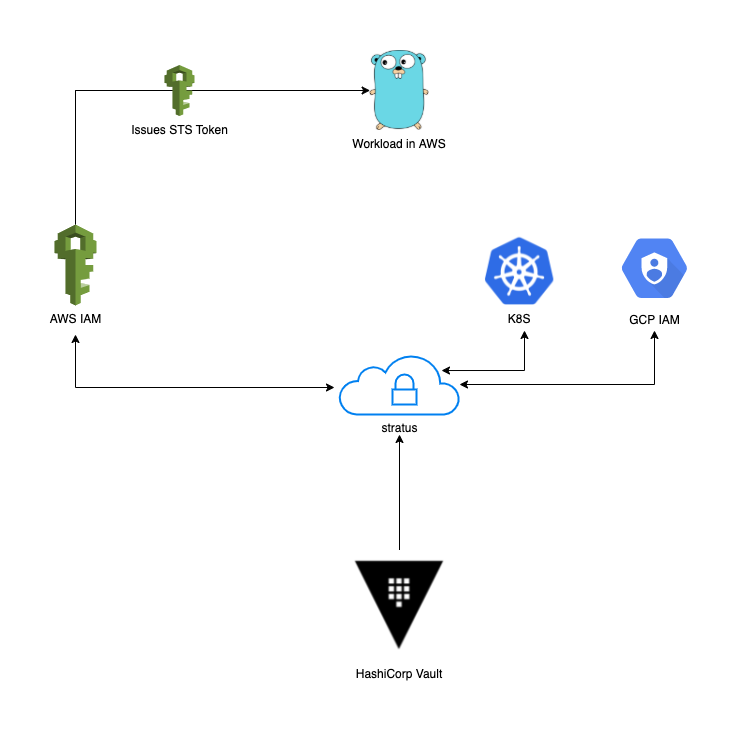

# stratus

stratus is a cross-cloud identity broker that allows workloads with an identity issued by one cloud provider to exchange this identity for a workload identity issued by another cloud provider. This enables workloads to cross cloud boundaries without having to rely on on application-local static credentials or single factor access tokens.

stratus effectively extends the cloud provider's IAM API to enable workloads to retrieve short-lived identity tokens from a remote cloud provider using their workload identity in thier current provider, without either cloud provider seeing the other's workload identity.



## Supported Clouds

### AWS

Both AWS IAM Service Accounts (`AWS_ACCESS_KEY_ID` and `AWS_SECRET_ACCESS_KEY`) and AWS STS sessions (`AWS_ACCESS_KEY_ID`, `AWS_SECRET_ACCESS_KEY`, `AWS_SESSION_TOKEN`) are supported.

When access keys are provided, stratus will validate the arn identity of the caller.

When session tokens are provided, stratus will validate the assumed arn identity of the caller.

## GCP

GCP Service Accounts are supported. When a GCP service account is provided, stratus will validate the service account private key against GCP's public key for the account, and will validate the identity matches the identity of the caller.

## K8S

Kubernetes Service Accounts are supported. When a Kubernetes service account is provided, stratus will validate the service account token against the Kubernetes API server. Stratus must have a service account token to validate the identity of the caller. The Kubernetes API server must be accessible from the stratus environment.

## Identity Mapping Configuration

All configuration is managed through version controlled configuration files in a dedicated [stratus-config repo](https://github.com/robertlestak/stratus-config).

An example config block is:

```yaml
- source:
    id: "stratus-example@sandbox.iam.gserviceaccount.com"
    provider: "gcp"
    region: "us-central1"
  target:
    id: "arn:aws:iam::xxxxxxxx:role/stratus-example"
    provider: "aws"
    region: us-east-1
```

This defines a workload in GCP (`source.provider`) with the identity `source.id` and a target workload in AWS (`target.provider`) with the identity `target.id`. 

## Client Usage

Below is an example of a client running in GCP exchanging their service account for an AWS IAM token.

```bash
# call stratus, passing in your source provider and credentials, and the target provider and identity
AWS_IDENTITY=`curl https://stratus/ -d '
{
	"source": {
		"id": "stratus-example@sandbox.iam.gserviceaccount.com",
		"provider": "gcp",
		"region": "us-central1",
		"credentials": {...},
	"target": {
		"id": "arn:aws:iam::xxxxxxxx:role/stratus-example",
		"provider": "aws",
		"region": "us-east-1"
	}
}
'`
# export the session token to use in cli / SDK calls. Can also be passed in to SDK credentials.Credentials config.
export AWS_ACCESS_KEY_ID=$(echo $AWS_IDENTITY | jq -r ".AccessKeyId")
export AWS_SECRET_ACCESS_KEY=$(echo $AWS_IDENTITY | jq -r ".SecretAccessKey")
export AWS_SESSION_TOKEN=$(echo $AWS_IDENTITY | jq -r ".SessionToken")

# confirm you now have an AWS session
aws sts get-caller-identity
```

## stratus Request

As seen in the example above, a stratus request contains two objects, `source` and `target`. The `source` object contains the identity of the workload issuing the request, and the `target` object contains the identity in the remote cloud you would like to assume. This matches the yaml config struct above.

The `source.credentials` field is a `map[string]interface{}` that contains the credentials from the cloud provider. In GCP, this is the JSON key file. 

In AWS, this is the Credentials object returned by AWS when you assume an IAM role:

```json
{
    "AccessKeyId": "string",
    "SecretAccessKey": "string",
    "SessionToken": "string",
    "Expiration": "time.Time"
}
```

In GCP, this is the ServiceAccount JSON object:

```json
{
    "type": "service_account",
    "project_id": "string",
    "private_key_id": "string",
    "private_key": "string",
    "client_email": "string",
    "client_id": "string",
    "auth_uri": "string",
    "token_uri": "string",
    "auth_provider_x509_cert_url": "string",
    "client_x509_cert_url": "string"
}
```

In K8S, this is the ServiceAccount JWT token:

```json
{
    "jwt": "string"
}
```

## stratus Response

On a successful identity exchange, stratus will reply with a HTTP 200 and JSON object containing the identity of the remote workload, matching the request object schema above. On any failure, stratus will reply with HTTP 401. stratus logs auth errors internally but does not propagate auth errors to the caller for increased opsec. Stratus propagates the request ID back to the client as `x-request-id` for correlation and tracing.

## stratus Priviledges

For AWS access, stratus will only ever return a single STS session token from an assumed role. The IAM role associated with stratus will need to be granted `sts:AssumeRole` on the target AWS IAM role, and the policy attached to stratus' IAM role must allow the `sts:AssumeRole` action. For each token, stratus will propagate a unique request ID which is associated with the session in AWS IAM and CloudTrail to correlate the session with the request in CloudTrail and logs.

GCP's concept of workload identity is still alpha (we are investigating potential integration options), however GCP has a longstanding standard of x509 public/private key pairs for workloads. As these are delivered client-side by GCP, stratus stores these encrypted at rest and in transit with HashiCorp Vault. When a new GCP Service Account is onboarded to stratus, it must be stored in Vault so that stratus can access it. As keys are stored in the central Vault, if a key needs to be rotated, it can be rotated in Vault and the new key will be propagated to all workloads.

In K8S, stratus requires access to validate tokens against the API server. This means stratus requires a service account in the cluster, and requires netpath access to the API server. See `docs/k8s` for more.

### Security Considerations

As an identity broker, stratus has access to all supported clouds, which is required to support the cross-cloud identity exchange. stratus has the ability to assume any supported target identity.

stratus ensures identity security by validating the identity of the caller against the respective cloud provider's identity API directly, and then validating the caller's identity (as returned by the cloud provider) matches a configured identity in the stratus config. This ensures that the caller is the owner of the workload identity as verified by the cloud provider, and that the caller has the right to assume an identity through stratus. Only then will stratus return a valid identity token to the caller. For AWS target identities, stratus will return a short-term (15 minute) session token. For GCP and K8S target identities, stratus will return a Service Account key that will be valid for the life of the key in GCP or K8S. When the key is rotated in the provider and Vault, the updated key will be propagated to the caller on the next token exchange.
